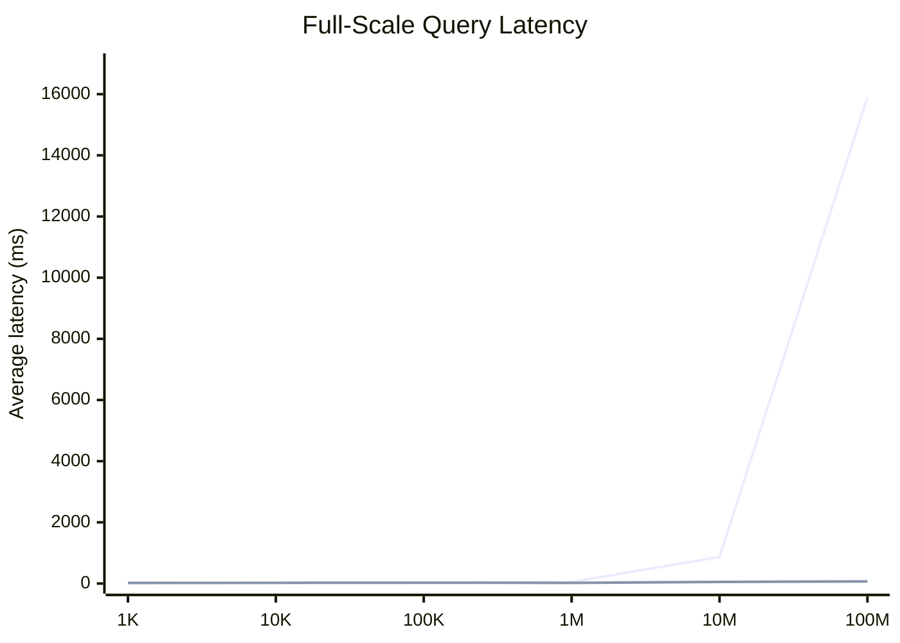
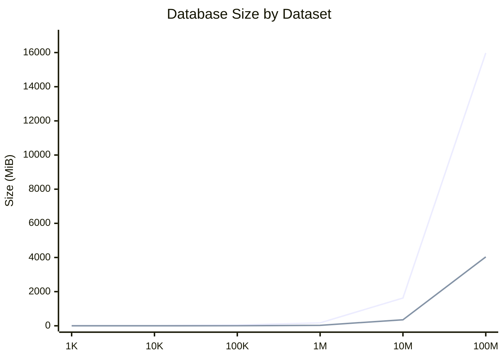

# Benchmark Summary

## Introduction

This document summarizes the benchmark runs captured from the local Docker-based benchmark stack on `2026-03-19`. Each dataset size was loaded into PostgreSQL using the repo's dataset presets, ClickHouse was refreshed from PostgreSQL after each load, and query latency was measured through `POST /api/grid/orders/benchmark` with `3` iterations using `page=0`, `size=100`, `sortBy=orderedAt`, and `sortDirection=desc`.

The data model in this benchmark is intentionally synthetic. Orders, customers, and products are only example entities used to create a repeatable joined grid workload. The goal is not to model a specific production domain, but to test how different architectural read patterns behave under the same logical access pattern as row counts grow.

The reason for this benchmark is architectural rather than purely technical. The current application behavior is an API aggregation pattern: the grid service reads orders from one source, calls other services for related customer and product data, then joins, sorts, and pages the result in application memory. That matches the current microservice-friendly approach, but it becomes expensive as data volume grows because every query has to coordinate multiple data sources and materialize more rows inside the application.

This project benchmarks that current approach against two alternatives that map directly to the decision under consideration:

- `API aggregation in memory`: keep the current approach, with aggregation and sorting in the application layer
- `Single PostgreSQL database with logical schemas`: move read-heavy grid queries into one operational database while preserving domain separation through schemas
- `ClickHouse read-only projection`: keep operational ownership elsewhere, but expose the grid from a read-optimized analytical store refreshed from source data

In practical terms, the question is not just which query is faster. The question is whether the current API aggregation pattern should remain the primary read path, whether those reads should be consolidated into one PostgreSQL database with logical separation, or whether they should move to a dedicated read-only ClickHouse projection. The benchmark is meant to show where the current API aggregation model stops scaling, where a schema-separated PostgreSQL approach starts to degrade, and where a ClickHouse projection becomes worth the refresh and storage overhead.

Storage values are reported using the current application metrics:

- PostgreSQL: whole database size via `pg_database_size(current_database())`
- ClickHouse: active data size via `sum(bytes_on_disk)` from `system.parts`

## Query Time Results

| Dataset | API Aggregation In Memory Avg (ms) | Single PostgreSQL Database With Logical Schemas Avg (ms) | ClickHouse Read-Only Projection Avg (ms) | Notes |
| --- | ---: | ---: | ---: | --- |
| 1K | 25.00 | 2.33 | 21.67 | All three patterns completed |
| 10K | 142.33 | 3.67 | 24.33 | All three patterns completed |
| 100K | N/A | 18.33 | 25.67 | API aggregation returned HTTP 500 |
| 1M | N/A | 52.33 | 23.33 | API aggregation returned HTTP 500 |
| 10M | N/A | 868.33 | 52.33 | API aggregation skipped as impractical |
| 100M | N/A | 15897.67 | 68.67 | API aggregation skipped as impractical |

## Database Size Results

| Dataset | PostgreSQL DB Size (MiB) | ClickHouse Active Data Size (MiB) | Load Time (s) | ClickHouse Refresh Time (s) |
| --- | ---: | ---: | ---: | ---: |
| 1K | 8.24 | 0.03 | 0.31 | 0.12 |
| 10K | 11.72 | 0.35 | 0.40 | 0.13 |
| 100K | 45.41 | 3.32 | 1.57 | 0.24 |
| 1M | 170.68 | 27.74 | 8.32 | 1.36 |
| 10M | 1626.60 | 353.33 | 91.65 | 16.70 |
| 100M | 15975.97 | 4035.30 | 1182.29 | 300.21 |

## Mermaid Charts

### Small-Scale Latency Comparison

Series order: API aggregation in memory, single PostgreSQL database with logical schemas, ClickHouse read-only projection.

```mermaid
xychart-beta
    title "Small-Scale Query Latency"
    x-axis ["1K", "10K"]
    y-axis "Average latency (ms)" 0 --> 160
    bar [25, 142]
    bar [2, 4]
    bar [22, 24]
```

### Full-Scale Latency Comparison

Series order: single PostgreSQL database with logical schemas, ClickHouse read-only projection.

### Database Size Comparison

Series order: PostgreSQL, ClickHouse.

## Summary

The single PostgreSQL database with logical schemas was the fastest option through `100K` rows, but it degraded sharply after that point. The ClickHouse read-only projection was slightly slower at the smallest sizes, then overtook PostgreSQL by `1M` rows and stayed comparatively flat all the way to `100M`.

The API aggregation in memory approach only completed at `1K` and `10K`, failed with HTTP `500` by `100K`, and was not attempted at `10M` and `100M` because the design requires materializing and joining the entire dataset in memory. That failure mode is itself a useful result because it shows the practical upper bound of the current aggregation model.

From an architecture perspective, the current API aggregation approach appears viable only at small scale. A single PostgreSQL database with logical schemas looks like the lowest-friction replacement if the workload stays in the `1K` to `1M` range and query latency in the tens of milliseconds is acceptable. If the target is predictable performance at `10M` to `100M` rows for grid-style queries, the ClickHouse read-only projection is the stronger read path, provided the system can tolerate refresh latency and the operational complexity of maintaining a second store.

On storage, ClickHouse remained materially smaller than PostgreSQL across every tested size. At `100M`, PostgreSQL reached about `15.60 GiB` of database size while ClickHouse active data was about `3.94 GiB`, with a `100M` PostgreSQL load taking about `19.7` minutes and the corresponding ClickHouse refresh taking about `5.0` minutes.
