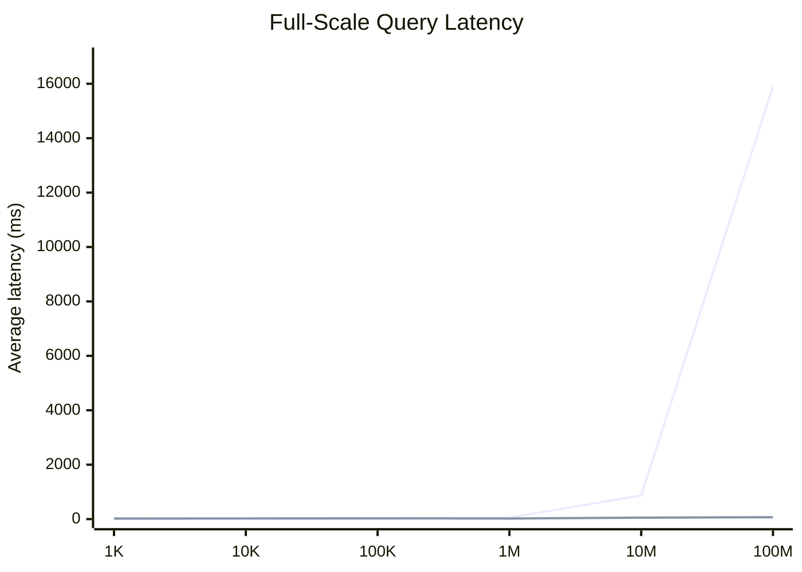
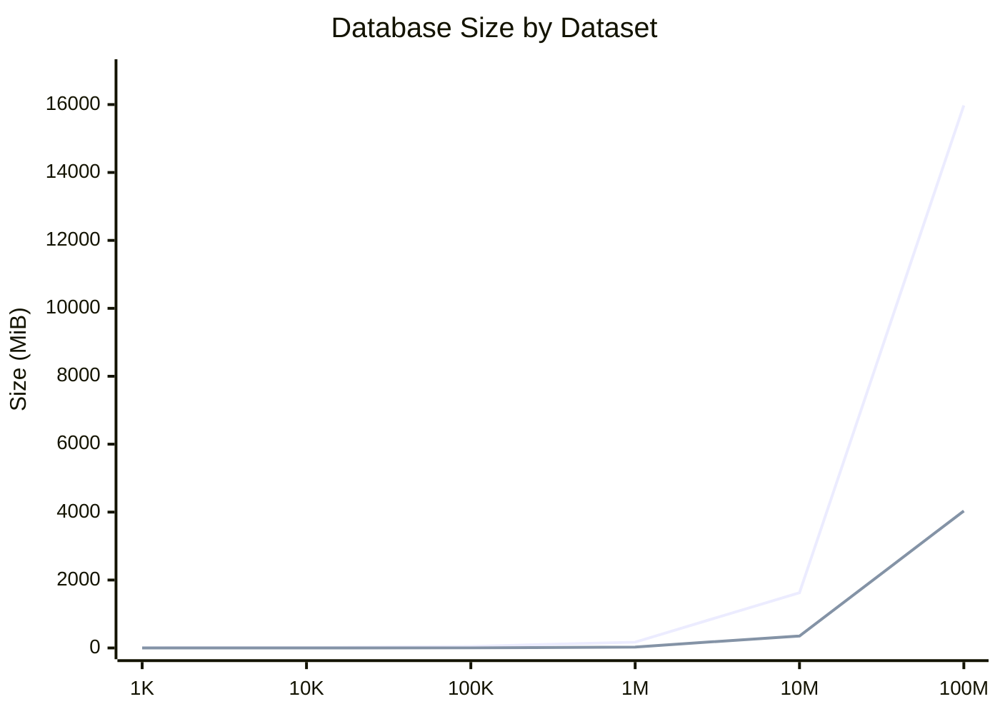

# Benchmark Summary

## Introduction

This document summarizes the benchmark runs captured from the local Docker-based benchmark stack on `2026-03-19`. Each dataset size was loaded into PostgreSQL using the repo's dataset presets, ClickHouse was refreshed from PostgreSQL after each load, and query latency was measured through `POST /api/grid/orders/benchmark` with `3` iterations using `page=0`, `size=100`, `sortBy=orderedAt`, and `sortDirection=desc`.

The three query patterns are:

- `A`: API join, sort, and page in memory
- `B`: PostgreSQL cross-schema view
- `C`: ClickHouse flattened table

Storage values are reported using the current application metrics:

- PostgreSQL: whole database size via `pg_database_size(current_database())`
- ClickHouse: active data size via `sum(bytes_on_disk)` from `system.parts`

## Query Time Results

| Dataset | Pattern A Avg (ms) | Pattern B Avg (ms) | Pattern C Avg (ms) | Notes |
| --- | ---: | ---: | ---: | --- |
| 1K | 25.00 | 2.33 | 21.67 | All three patterns completed |
| 10K | 142.33 | 3.67 | 24.33 | All three patterns completed |
| 100K | N/A | 18.33 | 25.67 | Pattern A returned HTTP 500 |
| 1M | N/A | 52.33 | 23.33 | Pattern A returned HTTP 500 |
| 10M | N/A | 868.33 | 52.33 | Pattern A skipped as impractical |
| 100M | N/A | 15897.67 | 68.67 | Pattern A skipped as impractical |

## Database Size Results

| Dataset | PostgreSQL DB Size (MiB) | ClickHouse Active Data Size (MiB) | Load Time (s) | ClickHouse Refresh Time (s) |
| --- | ---: | ---: | ---: | ---: |
| 1K | 8.24 | 0.03 | 0.31 | 0.12 |
| 10K | 11.72 | 0.35 | 0.40 | 0.13 |
| 100K | 45.41 | 3.32 | 1.57 | 0.24 |
| 1M | 170.68 | 27.74 | 8.32 | 1.36 |
| 10M | 1626.60 | 353.33 | 91.65 | 16.70 |
| 100M | 15975.97 | 4035.30 | 1182.29 | 300.21 |

## Mermaid Charts

### Small-Scale Latency Comparison

Series order: Pattern A, Pattern B, Pattern C.

```mermaid
xychart-beta
    title "Small-Scale Query Latency"
    x-axis ["1K", "10K"]
    y-axis "Average latency (ms)" 0 --> 160
    bar [25, 142]
    bar [2, 4]
    bar [22, 24]
```

### Full-Scale Latency Comparison

Series order: Pattern B, Pattern C.

### Database Size Comparison

Series order: PostgreSQL, ClickHouse.

## Summary

Pattern `B` was the fastest option through `100K` rows, but it degraded sharply after that point. Pattern `C` was slightly slower at the smallest sizes, then overtook PostgreSQL by `1M` rows and stayed comparatively flat all the way to `100M`.

Pattern `A` only completed at `1K` and `10K`, failed with HTTP `500` by `100K`, and was not attempted at `10M` and `100M` because the design requires materializing and joining the entire dataset in memory. That failure mode is itself a useful result for the project because it shows the practical upper bound of the API-join approach.

On storage, ClickHouse remained materially smaller than PostgreSQL across every tested size. At `100M`, PostgreSQL reached about `15.60 GiB` of database size while ClickHouse active data was about `3.94 GiB`, with a `100M` PostgreSQL load taking about `19.7` minutes and the corresponding ClickHouse refresh taking about `5.0` minutes.
