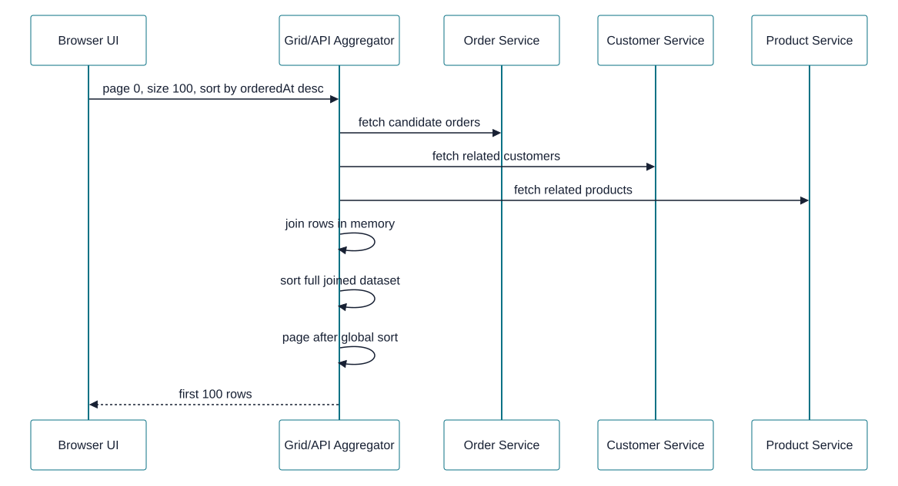
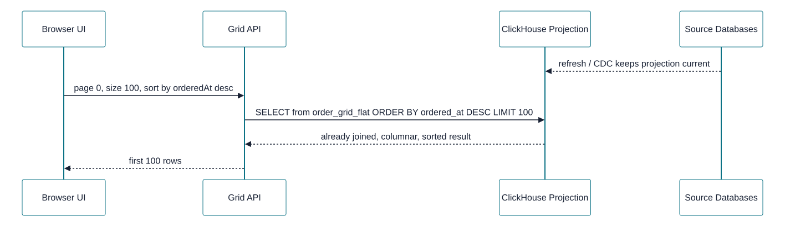
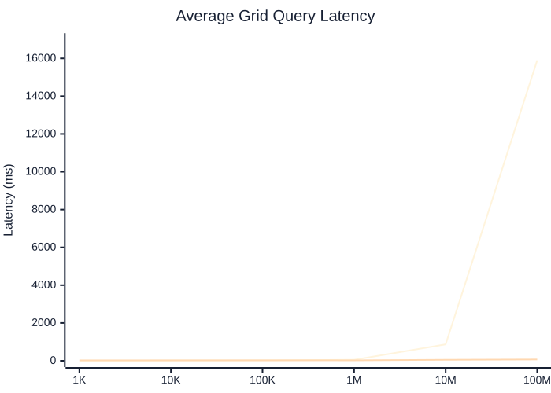
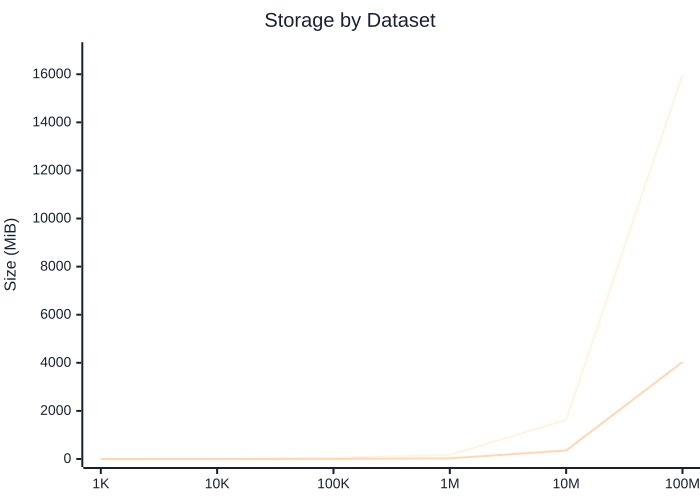

# ClickHouse as an Analytics Read Store

Microservices keep operational ownership local. Cross-service analytical queries need a different read path.

**Benchmark context:** order grid workload across orders, customers, and products.

---

## The Current Shape

Each service owns its data. The UI composes screens by calling service APIs.

This is a good transactional boundary: services can evolve independently and protect their write models.

---

## Where It Breaks

The grid needs one result set across service boundaries:

- order fields from the order service
- customer fields from the customer service
- product fields from the product service
- filtering, sorting, and paging across the combined data

The hard part is not joining three objects. The hard part is sorting and paging correctly when the complete ordered set lives across multiple services.

---

## The Failure Mode

Correct global sorting requires the aggregator to see the whole result set before it can return the first page.

The benchmark hit this limit quickly: API aggregation completed at `1K` and `10K`, failed at `100K`, and was skipped at `10M` and `100M`.

---

## Add a Query-Optimized Read Store

Keep service-owned operational databases. Sync the query shape into ClickHouse as a read-only projection.

ClickHouse does not take ownership of writes. It serves a read model designed for the analytical query.

---

## What Changes

The UI still asks for a grid page. The read path no longer has to fan out across services per request.

The join cost moves out of the request path, and the sort runs where the data layout is built for scans.

---

## Why ClickHouse Is Fast

### It is built for analytical reads

- **Columnar storage:** reads only the columns needed by the query
- **Compression:** fewer bytes move from disk to CPU
- **Vectorized execution:** processes batches efficiently
- **Data skipping:** avoids reading irrelevant parts when ordered or indexed well
- **Parallelism:** scans and aggregations use available cores

### It is not a Postgres replacement

- Postgres is the system of record for transactional writes
- Postgres is better for row-level updates, constraints, and OLTP workflows
- ClickHouse favors append-heavy analytical projections
- ClickHouse introduces refresh lag and duplicate storage
- The projection must be modeled around known query patterns

Use Postgres for correctness and ownership. Use ClickHouse when the read question is large, cross-domain, and analytical.

---

## Performance Results

Average latency for `POST /api/grid/orders/benchmark`, 3 iterations, `page=0`, `size=100`, `sortBy=orderedAt`, `sortDirection=desc`.

| Dataset | API Aggregation | Single Postgres | ClickHouse Projection |
| --- | ---: | ---: | ---: |
| 1K | 25.00 ms | 2.33 ms | 21.67 ms |
| 10K | 142.33 ms | 3.67 ms | 24.33 ms |
| 100K | HTTP 500 | 18.33 ms | 25.67 ms |
| 1M | HTTP 500 | 52.33 ms | 23.33 ms |
| 10M | skipped | 868.33 ms | 52.33 ms |
| 100M | skipped | 15,897.67 ms | 68.67 ms |

At `100M` rows, ClickHouse returned the grid query in about `69 ms`; Postgres took about `15.9 s`.

---

## Latency Curve

Series order: Single Postgres, ClickHouse projection.

Postgres is excellent at small sizes. ClickHouse stays flat when the workload becomes large and scan-heavy.

---

## Storage and Refresh Cost

| Dataset | Postgres Size | ClickHouse Size | ClickHouse Refresh |
| --- | ---: | ---: | ---: |
| 1M | 170.68 MiB | 27.74 MiB | 1.36 s |
| 10M | 1,626.60 MiB | 353.33 MiB | 16.70 s |
| 100M | 15,975.97 MiB | 4,035.30 MiB | 300.21 s |

ClickHouse was smaller at every tested size, but the projection is not free: refresh time and operational complexity are part of the design.

---

## Decision Frame

Choose the read path based on the query shape, not database preference.

- **API aggregation:** acceptable for small pages over small service-local datasets
- **Single Postgres with logical schemas:** low-friction option through moderate scale
- **ClickHouse read projection:** best fit for large, cross-service, scan-heavy analytical reads

The architectural move is not replacing microservices. It is adding a read model for questions microservices are structurally bad at answering.

